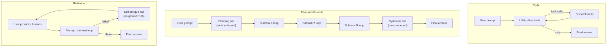

# Agentic Tool-Use Architecture Bake-Off

[](https://www.python.org/)
[](#getting-started)
[](../LICENSE)

Three agent architectures -- **ReAct**, **Plan-and-Execute**, and **Reflexion** -- implemented
from scratch directly against the OpenAI Chat Completions tool-use API (no LangChain
`AgentExecutor` or similar framework abstraction), evaluated head-to-head on the same
hand-built 35-task benchmark spanning arithmetic, multi-hop question answering, code
execution, and injected-error recovery.

## Table of Contents

- [Highlights](#highlights)
- [Approach](#approach)
- [Results](#results)
- [Repository Structure](#repository-structure)
- [Getting Started](#getting-started)
- [Design Notes](#design-notes)
- [Future Work](#future-work)
- [License](#license)

## Highlights

- **Three architectures, one shared low-level loop.** All three call the OpenAI
  Chat Completions API's tool-calling loop directly (`finish_reason == "tool_calls"` /
  `"stop"`, manual `tool_call_id` round-trips) -- the difference between them is
  purely in control flow, not in a different SDK surface.
- **A 35-task benchmark authored specifically to separate the architectures**, not
  borrowed from a public leaderboard: 9 arithmetic, 9 multi-hop QA, 9 code
  execution, and 8 error-recovery tasks (each reusing a base task with a tool call
  forced to fail once), every one with an unambiguous single correct answer.
- **A fully original, synthetic knowledge base** (17 short documents describing
  fictional companies, people, and products with deliberately chained facts) backs
  the multi-hop QA tasks -- no real documents, no external search API, no
  licensing risk, and full control over ground truth.
- **Hand-rolled tools, not off-the-shelf libraries**: an AST-whitelist calculator
  (no `eval()`), a sandboxed subprocess code executor, and an Okapi BM25 retrieval
  index, all implemented from scratch.
- **44 tests, zero real API calls.** Every architecture's control flow (stopping
  conditions, tool dispatch, retry-after-failure logic) is verified against a
  hand-written fake OpenAI client -- the automated test suite costs nothing and
  runs in well under a second.

## Approach



- **ReAct** -- a single flat loop with tools bound from turn one. No planning
  phase, no explicit retry: a tool error surfaces as an ordinary tool result the
  model may or may not recover from within the same loop.
- **Plan-and-Execute** -- an explicit planning call with `tools` deliberately
  **omitted** from the request (so nothing can execute before a plan exists),
  producing a JSON subtask list; one bounded tool-use loop per subtask, carrying
  prior results forward; then a synthesis call, also with tools unbound.
- **Reflexion** -- a bounded retry loop (default 3 attempts) keyed off explicit
  failure signals -- an unresolved tool error, exhausting the step budget, or the
  model admitting failure in its own words -- **never the ground-truth answer**.
  Between attempts, a dedicated self-critique call sees only the failed attempt's
  own transcript and produces "lessons learned" that are prepended to the next
  attempt's prompt.

Every tool call is dispatched through a single `ToolRegistry`, so the calculator,
code executor, and retrieval tool are identical objects across all three
architectures -- the benchmark is measuring architecture, not tool quality.

## Results

Results are generated by running `scripts/01_run_react.py` through
`scripts/04_summarize_results.py` against a live OpenAI API key (see
[Getting Started](#getting-started)) and are written to `reports/results_summary.md`
and `reports/figures/architecture_comparison.png`. That file is the source of truth
for actual numbers -- reproduce it yourself rather than trusting numbers pasted
here, since results depend on the exact model version and are not guaranteed to be
deterministic even at `temperature=0.0`.

## Repository Structure

```text
ml-agentic-tool-use-bakeoff/
├── README.md
├── requirements.txt
├── .env.example
├── src/
│   ├── config.py                 # Settings dataclass, paths, pricing table
│   ├── tasks.py                  # Task dataclass + loader
│   ├── metrics.py                # scoring + save_metrics/load_metrics
│   ├── tool_setup.py              # shared ToolRegistry + error-injection context manager
│   ├── tools/
│   │   ├── base.py               # Tool protocol, ToolResult, ToolRegistry, CallContext
│   │   ├── calculator.py         # AST-whitelist arithmetic (no eval())
│   │   ├── code_exec.py          # sandboxed subprocess Python execution
│   │   ├── retrieval.py          # hand-rolled BM25 over data/knowledge_base/
│   │   └── error_injection.py    # FlakyToolWrapper for error-recovery tasks
│   └── agents/
│       ├── base.py               # shared OpenAI tool-use loop
│       ├── react.py
│       ├── plan_execute.py
│       └── reflexion.py
├── data/
│   ├── tasks.jsonl                # 35 task definitions
│   └── knowledge_base/            # 17 synthetic documents + manifest.json
├── scripts/
│   ├── 01_run_react.py
│   ├── 02_run_plan_execute.py
│   ├── 03_run_reflexion.py
│   ├── 04_summarize_results.py    # aggregates + writes results_summary.md + figure
│   └── demo_single_task.py        # interactive single-task/architecture transcript
├── reports/                       # generated: *_metrics.json, results_summary.md, figures/
└── tests/                         # 44 tests, all mocked, zero API cost
```

## Getting Started

### Requirements

- Python 3.11+
- An OpenAI API key (a fresh account at [platform.openai.com](https://platform.openai.com)
  is separate from any ChatGPT subscription -- API usage is billed separately,
  pay-as-you-go, no ongoing cost once you stop using it)

### Setup

```bash
cd ml-agentic-tool-use-bakeoff
python3 -m venv .venv
source .venv/bin/activate
pip install -r requirements.txt
cp .env.example .env
# edit .env and set OPENAI_API_KEY
```

### Running the tests (free, no API key needed)

```bash
pytest -q
```

All 44 tests run against a hand-written fake OpenAI client -- this is the gate to
run before spending any real budget.

### Running the benchmark

```bash
# Sanity-check on a handful of tasks first
python scripts/01_run_react.py --limit 3
python scripts/02_run_plan_execute.py --limit 3
python scripts/03_run_reflexion.py --limit 3

# Full run (all 35 tasks, ~gpt-4.1-mini at current pricing costs a few dollars at most)
python scripts/01_run_react.py
python scripts/02_run_plan_execute.py
python scripts/03_run_reflexion.py
python scripts/04_summarize_results.py
```

### Watching one task run step by step

```bash
python scripts/demo_single_task.py --architecture reflexion --task-id err_004
```

Prints the full transcript for a single task/architecture pair -- useful for
watching a tool result come back with an injected error, a reflection get
generated, and the retry recover.

## Design Notes

- **Model:** defaults to `gpt-4.1-mini` (env-configurable via `OPENAI_MODEL_ID`)
  -- cheap enough ($0.40 / $1.60 per 1M input/output tokens) to use for both
  development and the final reported numbers, no dev/prod model split needed.
- **Code execution sandboxing is explicitly scoped.** The threat model (see
  `src/tools/code_exec.py`) is accidental/hallucinated destructive behavior from
  a fixed, self-authored task set -- not a defense against a determined
  attacker. A static AST pre-check rejects disallowed imports/builtins before
  any subprocess runs; the subprocess itself gets a minimal environment (no
  `OPENAI_API_KEY`), a wall-clock timeout, and (on Linux) a memory cap. `RLIMIT_AS`
  is intentionally **not** applied on macOS, where it's known to be unreliable
  against Python's own interpreter startup.
- **BM25, not embeddings, for retrieval.** A ~15-20 document synthetic corpus
  doesn't need vector search, and hand-rolling Okapi BM25 keeps the retrieval
  tool auditable and dependency-free, consistent with this repo's from-scratch
  approach elsewhere (see `ml-tiny-llm-gpt`, `ml-boston-climate-modeler`).
- **Ground truth never enters agent code.** `src/metrics.py::score_task` is the
  only place `task.expected_answer` is read; the Reflexion agent's self-critique
  prompt is built solely from the failed attempt's own transcript, verified by a
  dedicated regression test (`test_reflection_prompt_never_contains_expected_answer`).

## Future Work

- Compare BM25 retrieval against a local embedding-based retriever on the same
  multi-hop QA tasks.
- Add a second model (larger or smaller) to separate architecture effects from
  model-capability effects.
- Expand the error-recovery category to inject failures on the 2nd/3rd call to
  a tool, not just the 1st, to test sustained recovery rather than a single retry.
- A Berkeley Function-Calling-Leaderboard-style single-call precision benchmark
  as a complement to this project's multi-step focus.

## License

This project is part of the [applied-ml-projects](../README.md) monorepo,
licensed under the [MIT License](../LICENSE).
