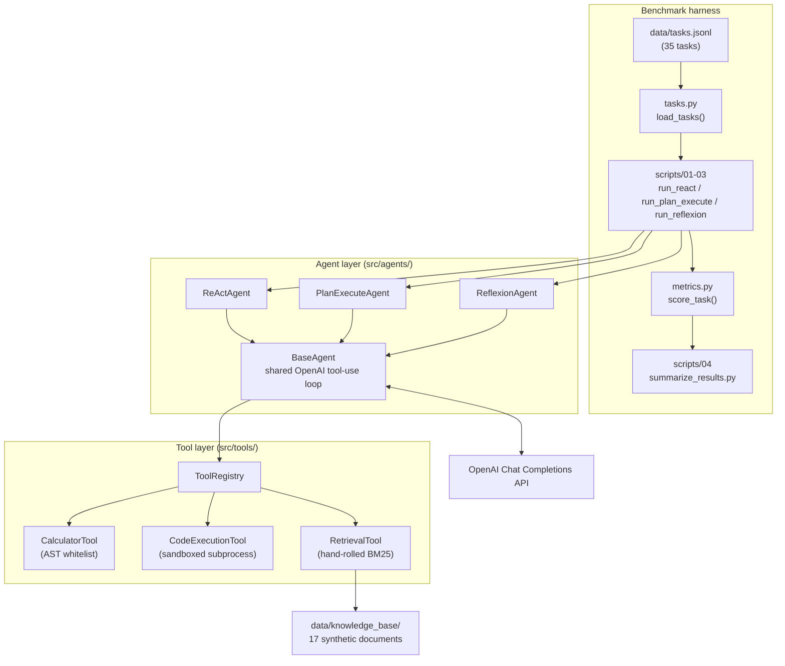
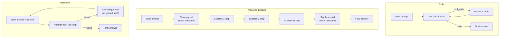
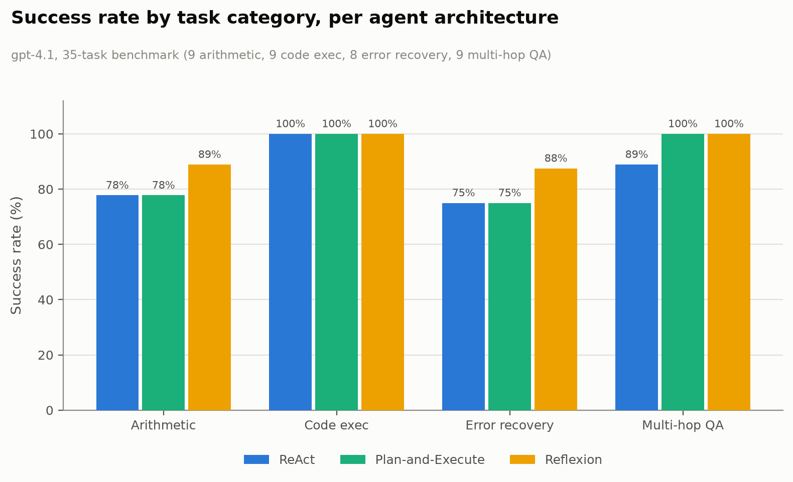
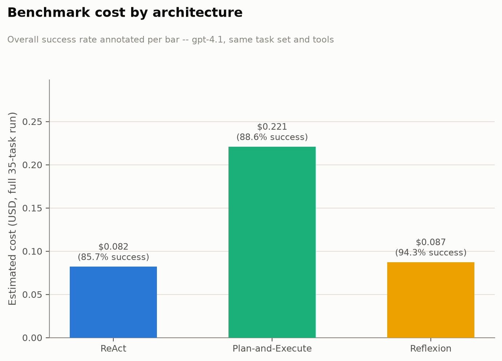

# Agentic Tool-Use Architecture Bake-Off

[](https://www.python.org/)
[](#getting-started)
[](../LICENSE)

Three agent architectures -- **ReAct**, **Plan-and-Execute**, and **Reflexion** -- implemented
from scratch directly against the OpenAI Chat Completions tool-use API (no LangChain
`AgentExecutor` or similar framework abstraction), evaluated head-to-head on the same
hand-built 35-task benchmark spanning arithmetic, multi-hop question answering, code
execution, and injected-error recovery.

## Table of Contents

- [Highlights](#highlights)
- [Repository Structure](#repository-structure)
- [Architecture](#architecture)
- [Results](#results)
- [Getting Started](#getting-started)
- [Design Notes](#design-notes)
- [References](#references)
- [License](#license)

## Highlights

- **Three architectures, one shared low-level loop.** All three call the OpenAI
  Chat Completions API's tool-calling loop directly (`finish_reason == "tool_calls"` /
  `"stop"`, manual `tool_call_id` round-trips) -- the difference between them is
  purely in control flow, not in a different SDK surface.
- **A 35-task benchmark authored specifically to separate the architectures**, not
  borrowed from a public leaderboard: 9 arithmetic, 9 multi-hop QA, 9 code
  execution, and 8 error-recovery tasks (each reusing a base task with a tool call
  forced to fail once), every one with an unambiguous single correct answer.
- **A fully original, synthetic knowledge base** (17 short documents describing
  fictional companies, people, and products with deliberately chained facts) backs
  the multi-hop QA tasks -- no real documents, no external search API, no
  licensing risk, and full control over ground truth.
- **Hand-rolled tools, not off-the-shelf libraries**: an AST-whitelist calculator
  (no `eval()`), a sandboxed subprocess code executor, and an Okapi BM25 retrieval
  index, all implemented from scratch.
- **44 tests, zero real API calls.** Every architecture's control flow (stopping
  conditions, tool dispatch, retry-after-failure logic) is verified against a
  hand-written fake OpenAI client -- the automated test suite costs nothing and
  runs in well under a second.
- **Actually run against the live OpenAI API**, not just the mocked test suite --
  see [Results](#results) for real success rates, costs, and a harness bug caught
  only by running against a real model.

## Repository Structure

```text
agentic-ai-tool-use/
├── README.md
├── requirements.txt
├── .env.example
├── src/
│   ├── config.py                 # Settings dataclass, paths, pricing table
│   ├── tasks.py                  # Task dataclass + loader
│   ├── metrics.py                # scoring + save_metrics/load_metrics
│   ├── tool_setup.py             # shared ToolRegistry + error-injection context manager
│   ├── tools/
│   │   ├── base.py               # Tool protocol, ToolResult, ToolRegistry, CallContext
│   │   ├── calculator.py         # AST-whitelist arithmetic (no eval())
│   │   ├── code_exec.py          # sandboxed subprocess Python execution
│   │   ├── retrieval.py          # hand-rolled BM25 over data/knowledge_base/
│   │   └── error_injection.py    # FlakyToolWrapper for error-recovery tasks
│   └── agents/
│       ├── base.py               # shared OpenAI tool-use loop
│       ├── react.py
│       ├── plan_execute.py
│       └── reflexion.py
├── data/
│   ├── tasks.jsonl                # 35 task definitions
│   └── knowledge_base/            # 17 synthetic documents + manifest.json
├── scripts/
│   ├── 01_run_react.py
│   ├── 02_run_plan_execute.py
│   ├── 03_run_reflexion.py
│   ├── 04_summarize_results.py    # aggregates + writes results_summary.md + figure
│   └── demo_single_task.py        # interactive single-task/architecture transcript
├── reports/                       # generated: *_metrics.json, results_summary.md, figures/
└── tests/                         # 44 tests, all mocked, zero API cost
```

## Architecture

### System Overview



The project is three layers wired together by the benchmark-runner scripts:

- **Benchmark harness** (`scripts/`, `src/tasks.py`, `src/metrics.py`) loads
  `data/tasks.jsonl`, runs every task through one architecture's `Agent.run()`, and
  scores the result. `score_task()` in `src/metrics.py` is the *only* place
  `task.expected_answer` is ever read -- neither the agents nor the tools ever see
  ground truth, so it cannot leak into a model's context.
- **Agent layer** (`src/agents/`) is three concrete agents (`ReActAgent`,
  `PlanExecuteAgent`, `ReflexionAgent`), all subclassing `BaseAgent` and sharing its
  `_run_tool_use_loop()` / `_run_notool_call()` primitives. The only thing that
  differs between architectures is how they call these two primitives and in what
  order -- not the underlying OpenAI plumbing.
- **Tool layer** (`src/tools/`) is a single `ToolRegistry` instance, shared
  identically across all three architectures, that dispatches to the calculator,
  code executor, and retrieval tool by name. Because the registry (and every tool
  inside it) is the same object regardless of which agent is running, the benchmark
  measures architecture, not tool quality or tool availability.

### Core Components

**`BaseAgent` and the shared tool-use loop** (`src/agents/base.py`)
`_run_tool_use_loop()` is the one piece of code that actually talks to the OpenAI
Chat Completions API with tools bound. Each iteration: call the API with
`tools=registry.to_openai_tools()` and `tool_choice="auto"`; if
`finish_reason == "tool_calls"`, dispatch every call in `message.tool_calls`
through `ToolRegistry.dispatch()`, append one `role: "tool"` message per call keyed
by `tool_call_id`, and loop; if `finish_reason == "stop"`, capture `message.content`
as the final answer and return. A `max_steps` bound guarantees termination even if
the model never stops calling tools. `_run_notool_call()` is the same idea with
`tools` omitted entirely -- used anywhere an LLM call must not be able to execute
anything (Plan-and-Execute's planning/synthesis calls, Reflexion's self-critique
call).

**`ToolRegistry` and `CallContext`** (`src/tools/base.py`)
`ToolRegistry` maps a tool name to a `Tool` implementing a small `Protocol`
(`name`, `description`, a JSON-schema `parameters`, and
`call(input, context) -> ToolResult`), and exposes `to_openai_tools()` to serialize
the whole registry into the JSON schema list the Chat Completions API expects for
its `tools` parameter. A `CallContext` (one per task run) is threaded through every
tool call, which is how `FlakyToolWrapper` knows which call number it's currently
on.

**Tools** (`src/tools/`)
- `CalculatorTool` parses the expression with `ast.parse` and walks a whitelist of
  node types (numeric literals, `BinOp`, `UnaryOp`, and a small set of operators)
  -- it never calls `eval()`.
- `CodeExecutionTool` runs model-generated Python in a subprocess: a static AST
  pre-check rejects disallowed imports/builtins before anything executes, the
  subprocess gets a minimal environment (`PATH` only -- no `OPENAI_API_KEY`), a
  wall-clock timeout, and (on Linux) an `RLIMIT_AS` memory cap.
- `RetrievalTool` wraps a hand-rolled Okapi BM25 index (`BM25Index`) built over
  `data/knowledge_base/`'s 17 synthetic documents at startup -- no embeddings, no
  vector store.
- `FlakyToolWrapper` (`src/tools/error_injection.py`) wraps any tool and forces its
  Nth call to fail with a synthetic error; `apply_error_injection()`
  (`src/tool_setup.py`) applies it as a context manager around a single task run to
  power the error-recovery category.

**Benchmark harness** (`src/tasks.py`, `src/metrics.py`, `scripts/`)
`Task` is a frozen dataclass loaded from `data/tasks.jsonl` (prompt, expected
answer, normalization mode, expected tools, optional error-injection spec).
`score_task()` exact-matches the agent's final answer against `expected_answer`
under the task's `answer_normalization` mode (`numeric`, `string_ci`, or
`string_exact`) and computes tool-call precision/recall against `expected_tools`.
`scripts/01-03` each run one architecture over all (or `--limit N`) tasks and save
a `*_metrics.json`; `scripts/04_summarize_results.py` aggregates all three into
`reports/results_summary.md` and a comparison figure.

### Per-Architecture Control Flow



- **ReAct** -- a single flat loop with tools bound from turn one. No planning
  phase, no explicit retry: a tool error surfaces as an ordinary tool result the
  model may or may not recover from within the same loop.
- **Plan-and-Execute** -- an explicit planning call with `tools` deliberately
  **omitted** from the request (so nothing can execute before a plan exists),
  producing a JSON subtask list; one bounded tool-use loop per subtask, carrying
  prior results forward; then a synthesis call, also with tools unbound.
- **Reflexion** -- a bounded retry loop (default 3 attempts) keyed off explicit
  failure signals -- an unresolved tool error, exhausting the step budget, or the
  model admitting failure in its own words -- **never the ground-truth answer**.
  Between attempts, a dedicated self-critique call sees only the failed attempt's
  own transcript and produces "lessons learned" that are prepended to the next
  attempt's prompt.

## Results

Results are generated by running `scripts/01_run_react.py` through
`scripts/04_summarize_results.py` against a live OpenAI API key (see
[Getting Started](#getting-started)) and are written to `reports/results_summary.md`
and `reports/figures/architecture_comparison.png`. **`reports/results_summary.md` is
still the source of truth for the numbers** (re-run the pipeline yourself for a fresh
copy, since results depend on the exact model version and are not guaranteed to be
deterministic even at `temperature=0.0`) -- the table below is a snapshot from an
actual run against the real OpenAI API on **2026-07-07**, model **`gpt-4.1`**
(`OPENAI_MODEL_ID=gpt-4.1` -- the mini default is cheaper but answers were harder to
keep terse enough for exact-match scoring at that size), full 35-task benchmark, total
measured cost **$0.39** across all three architectures.

| Architecture | Overall success | Mean LLM calls | Mean tool calls | Error recovery rate | Est. cost (USD) |
| --- | --- | --- | --- | --- | --- |
| ReAct | 85.71% | 2.26 | 1.26 | 75.00% | $0.0820 |
| Plan-and-Execute | 88.57% | 6.86 | 1.83 | 75.00% | $0.2208 |
| Reflexion | 94.29% | 2.51 | 1.29 | 87.50% | $0.0872 |

**Success rate by category:**

| Architecture | arithmetic | code_exec | error_recovery | multihop_qa |
| --- | --- | --- | --- | --- |
| ReAct | 77.78% | 100.00% | 75.00% | 88.89% |
| Plan-and-Execute | 77.78% | 100.00% | 75.00% | 100.00% |
| Reflexion | 88.89% | 100.00% | 87.50% | 100.00% |

<picture>
  <source media="(prefers-color-scheme: dark)" srcset="reports/success_by_category_dark.png">
  
</picture>

All three architectures hit 100% on `code_exec`, so that category doesn't discriminate between them on this task set. Reflexion's advantage is concentrated in `arithmetic` and `error_recovery` -- the two categories where its self-critique retry loop gets a second attempt at a task the other two architectures only get once.

<picture>
  <source media="(prefers-color-scheme: dark)" srcset="reports/cost_comparison_dark.png">
  
</picture>

Reflexion reaches the highest success rate (94.29%) at almost the same cost as ReAct ($0.087 vs $0.082) -- its extra LLM calls only fire on the tasks that fail on the first attempt. Plan-and-Execute pays a fixed per-task overhead (planning + per-subtask loop + synthesis call) that costs ~2.7x more than the other two architectures without buying a higher success rate.

**Finding worth flagging:** the first full run (before the numbers above) scored only
71-74% for ReAct/Reflexion, and that gap was mostly a harness bug, not a capability
gap. The original system prompts asked for "a direct final answer with no extra
commentary" but never said the answer had to be a *bare* value, so `gpt-4.1` correctly
solving `156 + 289` and answering "156 plus 289 is 445." was scored as a failure
against the `numeric`-mode exact-match scorer (which does a strict `float()` parse).
`tool_precision`/`tool_recall` were 1.0 on nearly every one of these "failures" --
the tool calls and reasoning were right, only the output format wasn't constrained
tightly enough. All three system prompts (`src/agents/react.py`,
`src/agents/plan_execute.py`, `src/agents/reflexion.py`) were patched to require a
bare fact ("445" not "The answer is 445", "Jane Okoye" not "Jane Okoye founded the
company"), and the numbers above are from the re-run after that fix. Reflexion came
out ahead post-fix (94.29%) because its self-critique loop recovers from the handful
of genuine reasoning/recovery misses that remain (see `reports/results_summary.md`
for the full breakdown, including the residual unit-inclusion failures like "1200
grams" vs the expected "1200" that the prompt fix didn't fully eliminate). Plan-and-
Execute is ~2.7x more expensive than the other two (6.86 mean LLM calls vs ~2.3-2.5)
because every task pays for a planning call, a per-subtask loop, and a synthesis
call even for single-step arithmetic.

## Getting Started

### Requirements

- Python 3.11+
- An OpenAI API key (a fresh account at [platform.openai.com](https://platform.openai.com)
  is separate from any ChatGPT subscription -- API usage is billed separately,
  pay-as-you-go, no ongoing cost once you stop using it)

### Setup

```bash
cd agentic-ai-tool-use
python3 -m venv .venv
source .venv/bin/activate
pip install -r requirements.txt
cp .env.example .env
# edit .env and set OPENAI_API_KEY
```

### Running the tests (free, no API key needed)

```bash
pytest -q
```

All 44 tests run against a hand-written fake OpenAI client -- this is the gate to
run before spending any real budget.

### Running the benchmark

```bash
# Sanity-check on a handful of tasks first
python scripts/01_run_react.py --limit 3
python scripts/02_run_plan_execute.py --limit 3
python scripts/03_run_reflexion.py --limit 3

# Full run (all 35 tasks; a few dollars at most, well under $1 with gpt-4.1-mini
# or gpt-4.1 at current pricing -- see Results above for actual measured cost)
python scripts/01_run_react.py
python scripts/02_run_plan_execute.py
python scripts/03_run_reflexion.py
python scripts/04_summarize_results.py
```

If you run scripts concurrently against the same OpenAI org, watch for
`RateLimitError` on tokens-per-minute -- lower-tier accounts can have a TPM limit
(e.g. 30,000) that two scripts running in parallel against `gpt-4.1` can exceed;
run them sequentially if that happens.

### Watching one task run step by step

```bash
python scripts/demo_single_task.py --architecture reflexion --task-id err_004
```

Prints the full transcript for a single task/architecture pair -- useful for
watching a tool result come back with an injected error, a reflection get
generated, and the retry recover.

## Design Notes

- **Model:** defaults to `gpt-4.1-mini` (env-configurable via `OPENAI_MODEL_ID`)
  -- cheap enough ($0.40 / $1.60 per 1M input/output tokens) to use for both
  development and the final reported numbers, no dev/prod model split needed. The
  [Results](#results) run above used `gpt-4.1` ($2.00 / $8.00 per 1M input/output
  tokens) instead, since larger models were easier to keep terse enough for
  exact-match scoring.
- **Code execution sandboxing is explicitly scoped.** The threat model (see
  `src/tools/code_exec.py`) is accidental/hallucinated destructive behavior from
  a fixed, self-authored task set -- not a defense against a determined
  attacker. A static AST pre-check rejects disallowed imports/builtins before
  any subprocess runs; the subprocess itself gets a minimal environment (no
  `OPENAI_API_KEY`), a wall-clock timeout, and (on Linux) a memory cap. `RLIMIT_AS`
  is intentionally **not** applied on macOS, where it's known to be unreliable
  against Python's own interpreter startup.
- **BM25, not embeddings, for retrieval.** A ~15-20 document synthetic corpus
  doesn't need vector search, and hand-rolling Okapi BM25 keeps the retrieval
  tool auditable and dependency-free, consistent with this repo's from-scratch
  approach elsewhere (see `ml-tiny-llm-gpt`, `ml-boston-climate-modeler`).
- **Ground truth never enters agent code.** `src/metrics.py::score_task` is the
  only place `task.expected_answer` is read; the Reflexion agent's self-critique
  prompt is built solely from the failed attempt's own transcript, verified by a
  dedicated regression test (`test_reflection_prompt_never_contains_expected_answer`).
- **Exact-match scoring requires the model's output format to be constrained, not
  just its tool use.** The [Results](#results) section documents a real instance of
  this: system prompts that didn't specify "bare value, no sentence" cost 15-20
  points of measured success rate against otherwise-correct answers.

## References

Papers and resources that directly informed the architectures and tools
implemented here.

- Yao, S., et al. "ReAct: Synergizing Reasoning and Acting in Language Models."
  *ICLR*, 2023. [arxiv.org/abs/2210.03629](https://arxiv.org/abs/2210.03629) --
  the interleaved reasoning/acting loop implemented in `src/agents/react.py`.
- Wang, L., et al. "Plan-and-Solve Prompting: Improving Zero-Shot Chain-of-Thought
  Reasoning by Large Language Models." *ACL*, 2023.
  [arxiv.org/abs/2305.04091](https://arxiv.org/abs/2305.04091) -- the
  planning/execution/synthesis split implemented in `src/agents/plan_execute.py`.
- Shinn, N., et al. "Reflexion: Language Agents with Verbal Reinforcement
  Learning." *NeurIPS*, 2023.
  [arxiv.org/abs/2303.11366](https://arxiv.org/abs/2303.11366) -- the bounded
  retry + self-critique loop implemented in `src/agents/reflexion.py`.
- Robertson, S., and Zaragoza, H. "The Probabilistic Relevance Framework: BM25
  and Beyond." *Foundations and Trends in Information Retrieval*, 2009.
  [doi.org/10.1561/1500000019](https://doi.org/10.1561/1500000019) -- the ranking
  function behind `RetrievalTool`'s hand-rolled `BM25Index`.
- OpenAI. Function calling / tool-use guide for the Chat Completions API.
  [platform.openai.com/docs/guides/function-calling](https://platform.openai.com/docs/guides/function-calling)
  -- the `tools` / `tool_choice` / `finish_reason == "tool_calls"` contract every
  agent here is built directly against.

## License

This project is part of the [applied-ml-projects](../README.md) monorepo,
licensed under the [MIT License](../LICENSE).
