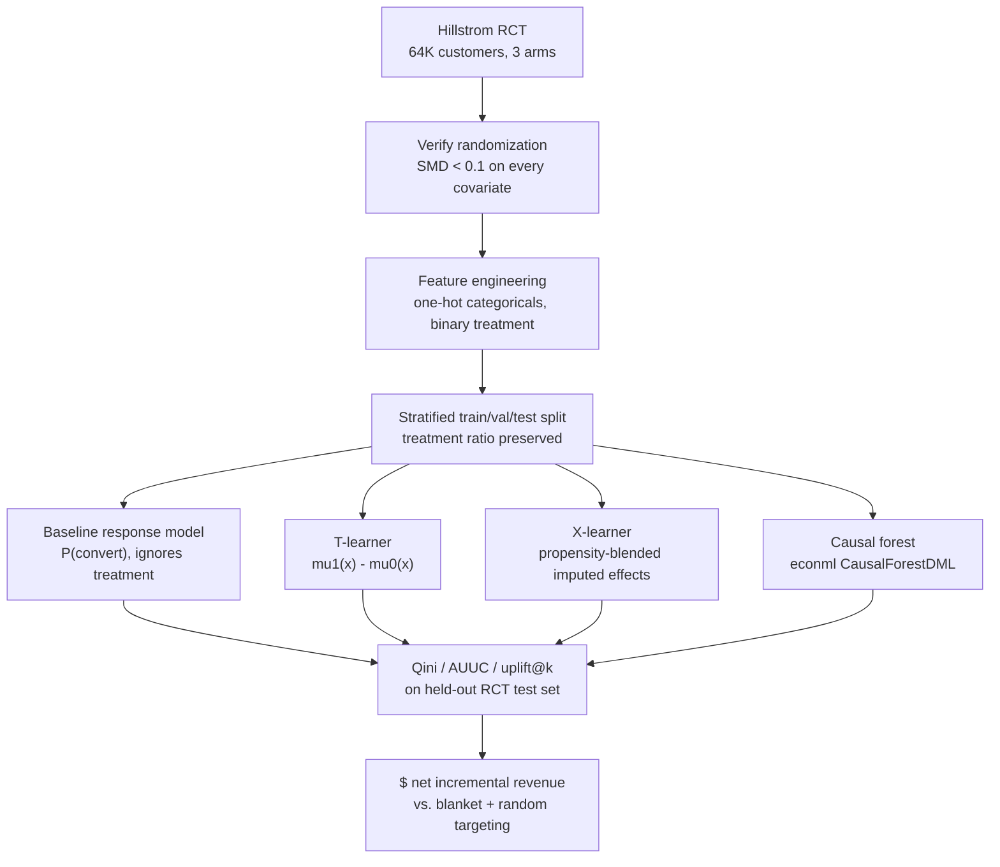

# Churn Predictor: Uplift Modeling for Retention Targeting

[](https://www.python.org/)
[](https://scikit-learn.org/)
[](https://github.com/py-why/EconML)
[](../LICENSE)

## Highlights

- **Predicts who is influenced by an offer, not who is likely to churn/convert.** Three CATE (conditional average treatment effect) estimators — a hand-rolled T-learner, a hand-rolled X-learner (Künzel et al., 2019), and a causal forest (`econml`'s `CausalForestDML`) — are trained side by side against a naive "predict conversion, ignore treatment" baseline, on the exact same features and split.
- **A genuine randomized controlled trial, not a simulation.** Uses Kevin Hillstrom's MineThatData email challenge — 64,000 real customers randomized into email/no-email arms — so every causal number below comes from actual counterfactual data, not an invented ground-truth treatment effect. Randomization is verified, not assumed: every covariate's standardized mean difference is checked before trusting any downstream estimate (all < 0.03 here).
- **Evaluated on causal-inference terms, not classification terms.** Qini curves/coefficients, AUUC, uplift@k, and per-decile calibration — all built from group-level treated-vs-control comparisons on held-out data, since individual treatment effects are fundamentally unobservable.
- **A genuine $ number.** `scripts/08_revenue_simulation.py` turns predicted uplift into a net-incremental-revenue comparison against blanket targeting (offer everyone) and random targeting, under an explicit assumed cost per offer — see Results.
- **Honest about what didn't work.** The hand-rolled T-learner and X-learner both score *worse* than random targeting on this dataset (negative Qini coefficients); only the causal forest beats random targeting. That's reported directly rather than cherry-picked away — see Results and Limitations.

## Project Structure

```
.
├── data/
│   ├── raw/hillstrom.csv                 # downloaded, gitignored
│   ├── processed/                        # encoded train/val/test splits + predictions, gitignored
│   └── data.md
├── models/trained/                       # gitignored, fast to retrain
├── src/
│   ├── config.py                         # paths, schema, cost assumptions
│   ├── data.py                           # download + covariate-balance / randomization check
│   ├── features.py                       # one-hot encoding, stratified train/val/test split
│   ├── baseline_model.py                 # naive response model (the anti-pattern)
│   ├── predictions.py                    # shared test-set prediction accumulator
│   ├── uplift/
│   │   ├── base.py                       # common UpliftModel interface
│   │   ├── t_learner.py                  # hand-rolled
│   │   ├── x_learner.py                  # hand-rolled
│   │   └── causal_forest.py              # econml CausalForestDML wrapper
│   └── evaluation/
│       ├── qini.py                       # Qini curve + coefficient
│       ├── metrics.py                    # AUUC, uplift@k, decile calibration
│       └── revenue.py                    # $ policy comparison
├── scripts/
│   ├── 01_download_and_validate_rct.py
│   ├── 02_build_features.py
│   ├── 03_baseline_response_model.py
│   ├── 04_t_learner.py
│   ├── 05_x_learner.py
│   ├── 06_causal_forest.py
│   ├── 07_evaluate_uplift.py
│   ├── 08_revenue_simulation.py
│   ├── 09_summarize_results.py
│   └── run_all.sh
├── reports/
│   ├── results_summary.md                # generated by script 09
│   └── figures/qini_curves.png
└── tests/                                # 22 tests: hand-rolled learners vs. known synthetic CATE, hand-computed Qini/revenue examples
```

## Data

**Kevin Hillstrom's MineThatData E-Mail Analytics And Data Mining Challenge**: 64,000 customers who purchased within the last 12 months, randomized into three arms (no email / men's email / women's email), with `visit`/`conversion`/`spend` recorded over the following two weeks. This project combines both email arms into a single binary `treatment` vs. control.

There's no public RCT dataset for subscription churn specifically. This project uses Hillstrom's real randomized promotional-email data as the causal-inference benchmark instead of simulating a treatment effect on top of a churn dataset: the mechanics of "who is influenced by being targeted, and by how much" are identical to a telco/SaaS retention-offer decision, and real randomization means every $ figure below is computed from genuine counterfactual data. See [data/data.md](data/data.md) for the full schema and source URL.

## Approach



### Why a T-learner and an X-learner, hand-rolled

- **T-learner**: fit one regressor on treated customers, one on control customers; predicted uplift is the difference of their predictions. Simple, but each model only sees half the data, and differencing two independently-fit models can be noisy.
- **X-learner**: reuses the *other* arm's outcome model to impute individual treatment effects (`D1 = Y - mu0(X)` for treated, `D0 = mu1(X) - Y` for control), regresses on those imputed effects, then blends the two resulting effect models by an estimated propensity score. Designed to handle treatment-group imbalance better than a T-learner (Hillstrom's ~1:2 no-email:email split is a mild case of this).
- **Causal forest**: used via `econml.dml.CausalForestDML` rather than reimplemented — an honest-splitting causal forest (Athey & Wager, 2019) is a research-grade tree ensemble with its own sample-splitting and variance machinery; the correctness risk of a from-scratch version outweighs the teaching value here, matching this repo's general pattern of implementing from scratch where it's educational and reaching for a library where correctness dominates.

### Evaluation: causal-inference metrics, not classification metrics

Individual treatment effects are fundamentally unobservable (only one of Y(1)/Y(0) is ever seen per customer). What *is* testable on held-out RCT data is the *average* realized incremental outcome within a group, so every metric here is a group-level treated-vs-control comparison:

- **Qini curve/coefficient** (Radcliffe & Surry, 2011): orders customers by predicted uplift, plots cumulative incremental spend vs. random targeting.
- **AUUC**: raw area under the uplift curve.
- **uplift@20%**: realized incremental spend among the top 20% by predicted uplift.
- **Per-decile calibration**: predicted vs. realized uplift by decile, the standard defensible sanity check given the fundamental problem of causal inference.

## Results

All numbers below are from an actual run of `scripts/run_all.sh` against the real, downloaded Hillstrom dataset (44,799 train / 9,601 val / 9,600 test rows, 66.7% treatment rate preserved across all splits). Regenerated by `scripts/09_summarize_results.py` into [reports/results_summary.md](reports/results_summary.md).

**Randomization check**: every observed covariate has |SMD| < 0.02 between treatment and control (max: `history_segment_2) $100 - $200` at 0.015) — randomization held, so treated-vs-control differences below are causal, not confounded.

### Uplift model comparison (held-out test set)

| Model | Qini coefficient | AUUC | Uplift@20% |
|---|---:|---:|---:|
| Baseline response model (ignores treatment) | -389.9 | 1621.3 | $0.93 |
| T-learner | -531.0 | 1480.2 | -$0.27 |
| X-learner | -249.3 | 1761.9 | $0.27 |
| **Causal forest** | **+369.0** | **2380.3** | **$0.76** |

Only the causal forest beats random targeting (positive Qini coefficient). The hand-rolled T-learner and X-learner both underperform random ranking on this dataset — a real, unflattering result reported as-is rather than adjusted away; see Limitations for why. The baseline response model's positive `uplift_at_20pct` is a coincidence of overall population uplift, not evidence it's finding the right customers (see the Qini curve below: its curve sits on or below the random-targeting diagonal for most of the range).


### $ net incremental revenue by targeting policy

At an assumed **$2.00 cost per offer** (representing a live retention outreach — a phone call or discount code — rather than a near-free marketing email):

| Policy (top 5% targeted) | Incremental revenue | Cost | Net revenue |
|---|---:|---:|---:|
| **Causal forest** | **$762** | $960 | **-$198** |
| Random targeting | $301 | $960 | -$659 |
| Baseline response model | -$24 | $960 | -$984 |
| X-learner | -$1,128 | $960 | -$2,088 |
| T-learner | -$1,280 | $960 | -$2,240 |
| Blanket (target 100%) | $6,030 | $19,200 | **-$13,170** |

No policy is unconditionally profitable at this assumed cost — the dataset's overall average treatment effect (~$0.63/customer) is modest. But **targeting the top 5% by causal-forest-predicted uplift reduces net losses by 98.5% relative to blanket targeting** (-$198 vs. -$13,170) while still capturing $762 of real incremental revenue — 12.6% of the total achievable incremental revenue for 2.5% of the campaign cost, a >2.5x better return per dollar spent than blanketing every customer (79¢ vs. 31¢ incremental revenue per dollar spent). That comparison — not a single AUC number — is the actual business case for uplift modeling over blanket retention offers. Full sweep across targeting fractions (5%-100%) in [reports/revenue_policy_comparison.csv](reports/revenue_policy_comparison.csv).

## Limitations

- **Marketing RCT, not a churn RCT.** Hillstrom's outcome is post-campaign spend for a retailer, not subscription retention. The causal-inference mechanics transfer directly to a retention-offer decision, but the specific dollar figures above shouldn't be read as "this is what a telco would see."
- **T-learner/X-learner underperforming random targeting is a real finding, not a bug.** Both regress on relatively noisy imputed/differenced effects over a dataset with a fairly weak and diffuse true heterogeneous effect; this is a known failure mode for meta-learners in low-signal settings (see Künzel et al., 2019, and the broader uplift-modeling literature on when meta-learners struggle) and part of why causal forests are often preferred in practice.
- **The $2/offer cost is a documented assumption**, not a figure recovered from data — it's swept in [reports/revenue_policy_comparison.csv](reports/revenue_policy_comparison.csv) and configurable via `--cost-per-offer` on `scripts/08_revenue_simulation.py`; the qualitative conclusion (causal forest dominates other policies' loss-per-dollar) holds well below $2, and the specific breakeven cost is not something this dataset's effect size will reach for any policy.
- **Test-set revenue estimates are noisy.** With a $9,600-row test set and a low base spend rate, the per-bucket incremental revenue figures (especially at the 5%/10% targeting fractions, ~480-960 rows) carry real sampling uncertainty that this project does not currently report confidence intervals for.

## Getting Started

```bash
cd churn-predictor
python3 -m venv .venv && source .venv/bin/activate
pip install -r requirements.txt
bash scripts/run_all.sh
```

Or run any stage individually — every script is idempotent and reads its inputs from `data/processed/`:

```bash
python scripts/01_download_and_validate_rct.py
python scripts/02_build_features.py
python scripts/03_baseline_response_model.py
python scripts/04_t_learner.py
python scripts/05_x_learner.py
python scripts/06_causal_forest.py
python scripts/07_evaluate_uplift.py
python scripts/08_revenue_simulation.py --cost-per-offer 2.0
python scripts/09_summarize_results.py
```

Tests: `pytest tests/`

## References

- Künzel, S.R., Sekhon, J.S., Bickel, P.J., and Yu, B. "Metalearners for Estimating Heterogeneous Treatment Effects using Machine Learning." *PNAS*, 2019. [arxiv.org/abs/1706.03461](https://arxiv.org/abs/1706.03461)
- Athey, S., and Wager, S. "Estimating Treatment Effects with Causal Forests: An Application." *Observational Studies*, 2019. [arxiv.org/abs/1902.07409](https://arxiv.org/abs/1902.07409)
- Radcliffe, N.J., and Surry, P.D. "Real-World Uplift Modelling with Significance-Based Uplift Trees." *Portrait Technical Report*, 2011.
- Gutierrez, P., and Gérardy, J-Y. "Causal Inference and Uplift Modelling: A Review of the Literature." *JMLR Workshop and Conference Proceedings*, 2017.
- Hillstrom, K. "The MineThatData E-Mail Analytics And Data Mining Challenge." 2008. [minethatdata.com](http://www.minethatdata.com/Kevin_Hillstrom_MineThatData_E-MailAnalytics_DataMiningChallenge_2008.03.20.csv)

## License

This project is part of the [applied-ml-projects](../README.md) monorepo, licensed under the [MIT License](../LICENSE).
