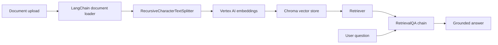

# Vertex AI RAG Document Chatbot

[](https://www.python.org/)
[](LICENSE)
[](https://www.langchain.com/)
[](https://cloud.google.com/vertex-ai)
[](https://ai.google.dev/gemini-api)
[](https://www.gradio.app/)
[](https://www.docker.com/)
[](https://cloud.google.com/run)

A retrieval-augmented generation (RAG) app that lets users upload a document (PDF, TXT, Markdown, CSV, or DOCX) and ask questions answered from its content, built with LangChain, Google Vertex AI, Gemini, Chroma, and Gradio.

This repository is a portfolio-ready reference implementation: a runnable document Q&A interface, Cloud Run deployment instructions, cleaned standalone examples for core RAG concepts, sample documents, and concise architecture documentation.

## Demo

**Live demo:** https://rag-pdf-chatbot-715060982814.us-central1.run.app

Run the app locally or deploy it to Cloud Run, upload a document, and ask a question about its contents.

```text
Document Upload -> Document Loader -> Text Splitter -> Vertex AI Embeddings -> Chroma -> Retriever -> Gemini -> Answer
```



## Features

- Upload a PDF, TXT, Markdown, CSV, or DOCX file through a Gradio web interface
- Load documents with LangChain document loaders
- Split long documents into overlapping chunks
- Embed chunks with Vertex AI `text-embedding-004`
- Store vectors in Chroma for semantic retrieval
- Answer questions using Gemini on Vertex AI
- Run locally with Application Default Credentials
- Deploy to Cloud Run with scale-to-zero cost controls
- Include cleaned standalone examples for each major RAG concept

## Tech Stack

| Layer | Technology |
| --- | --- |
| Language | Python 3.11 |
| Orchestration | LangChain |
| LLM | Gemini (Google Vertex AI) |
| Embeddings | Vertex AI `text-embedding-004` |
| Vector store | Chroma |
| Document parsing | PyPDF, docx2txt, LangChain loaders |
| UI | Gradio |
| Containerization | Docker |
| Hosting | Google Cloud Run |

## Project Structure

```text
.
├── app/
│   ├── config.py          # Environment-driven settings
│   ├── main.py            # Gradio app entry point
│   ├── rag_pipeline.py    # Document loading, chunking, embeddings, retrieval, QA
│   └── ui.py              # Gradio interface
├── data/                  # Sample documents used by scripts
│   └── sample_documents/
├── scripts/               # Legacy teaching examples, not used by the app runtime
│   ├── 01_document_loaders.py
│   ├── 02_context_window_limits.py
│   ├── 03_text_splitting.py
│   ├── 04_embeddings.py
│   ├── 05_vector_stores.py
│   └── 06_retrievers.py
├── .dockerignore
├── .gcloudignore
├── Dockerfile
├── requirements-app.txt   # Lean runtime dependencies for Cloud Run
├── requirements.txt
├── architecture.md
├── LICENSE
└── README.md
```

## Quickstart

1. Create and activate a virtual environment.

```bash
python3 -m venv .venv
source .venv/bin/activate
```

2. Install dependencies.

```bash
pip install -r requirements.txt
```

The Cloud Run image installs `requirements-app.txt`, which excludes legacy script-only packages so the deployed runtime stays smaller.

3. Configure Google Cloud credentials.

```bash
gcloud auth application-default login
cp .env.example .env
```

Then edit `.env` and set `GCP_PROJECT_ID` to a Google Cloud project with billing linked and the Vertex AI API enabled.

4. Start the app.

```bash
python3 -m app.main
```

Open the local Gradio URL shown in the terminal, upload a document, and ask a question.

Tests: `pytest tests/` (covers config, document loading/chunking, and UI wiring; Vertex AI calls need live GCP credentials and are out of scope for these offline unit tests)

## Configuration

The app is configured through environment variables:

| Variable | Purpose |
| --- | --- |
| `GCP_PROJECT_ID` | Google Cloud project used for Vertex AI |
| `GCP_LOCATION` | Vertex AI region, defaults to `us-central1` |
| `VERTEX_LLM_MODEL_ID` | Gemini model used for answer generation |
| `VERTEX_EMBEDDING_MODEL_ID` | Vertex AI embedding model used for document vectors |
| `MAX_NEW_TOKENS` | Maximum output tokens for generated answers |
| `TEMPERATURE` | Sampling temperature for generated answers |
| `CHUNK_SIZE` | Character length for document chunks |
| `CHUNK_OVERLAP` | Overlap between neighboring chunks |
| `GRADIO_SERVER_NAME` | Local server host |
| `GRADIO_SERVER_PORT` | Local server port |

Cloud Run injects `PORT`; when present, it takes precedence over `GRADIO_SERVER_PORT`.
The default `MAX_NEW_TOKENS` is intentionally set to `2048` for Gemini 2.5 Flash because its thinking tokens count against the generated-token budget.

## How It Works

The RAG pipeline is implemented in `app/rag_pipeline.py`:

1. A user uploads a document (PDF, TXT, Markdown, CSV, or DOCX).
2. A LangChain document loader, chosen by file extension, extracts the document text.
3. `RecursiveCharacterTextSplitter` creates chunks that fit retrieval and model context limits.
4. `VertexAIEmbeddings` converts chunks into vectors.
5. Chroma stores the vectors and performs semantic search.
6. LangChain's `RetrievalQA` chain sends the retrieved context and question to Gemini.
7. The model returns an answer grounded in the uploaded document.

The `scripts/` directory remains as legacy Watsonx/HuggingFace teaching material and is not used by the deployed app runtime.

## Google Cloud Setup

Install and authenticate the Google Cloud SDK:

```bash
brew install --cask google-cloud-sdk
gcloud auth login
gcloud auth application-default login
```

Use an existing project or create a new demo project:

```bash
gcloud projects create YOUR_PROJECT_ID --name="rag-vertex-demo"
gcloud config set project YOUR_PROJECT_ID
gcloud billing accounts list
gcloud billing projects link YOUR_PROJECT_ID --billing-account=BILLING_ACCOUNT_ID
```

Enable the APIs used by Vertex AI, Cloud Run, Cloud Build, and Artifact Registry:

```bash
gcloud services enable aiplatform.googleapis.com run.googleapis.com \
  artifactregistry.googleapis.com cloudbuild.googleapis.com \
  --project=YOUR_PROJECT_ID
```

## Deployment

The app includes a `Dockerfile` for Cloud Run. Create an Artifact Registry repository once, then build and push the image with `docker buildx` and deploy it by reference (Cloud Run requires `linux/amd64`, so explicitly target that platform if you're building on Apple Silicon):

```bash
gcloud artifacts repositories create rag-pdf-chatbot \
  --repository-format=docker \
  --location=us-central1 \
  --project=YOUR_PROJECT_ID

gcloud auth configure-docker us-central1-docker.pkg.dev

docker buildx build --platform linux/amd64 \
  -t us-central1-docker.pkg.dev/YOUR_PROJECT_ID/rag-pdf-chatbot/rag-pdf-chatbot:latest \
  --push .
```

Then deploy from that image for a live demo that scales to zero when idle:

```bash
gcloud run deploy rag-pdf-chatbot \
  --image=us-central1-docker.pkg.dev/YOUR_PROJECT_ID/rag-pdf-chatbot/rag-pdf-chatbot:latest \
  --region=us-central1 \
  --allow-unauthenticated \
  --min-instances=0 \
  --max-instances=1 \
  --memory=2Gi --cpu=2 \
  --timeout=300 \
  --set-env-vars=GCP_PROJECT_ID=YOUR_PROJECT_ID,GCP_LOCATION=us-central1,VERTEX_LLM_MODEL_ID=gemini-2.5-flash,VERTEX_EMBEDDING_MODEL_ID=text-embedding-004 \
  --project=YOUR_PROJECT_ID
```

Grant the Cloud Run runtime service account Vertex AI access once:

```bash
PROJECT_NUMBER=$(gcloud projects describe YOUR_PROJECT_ID --format='value(projectNumber)')
gcloud projects add-iam-policy-binding YOUR_PROJECT_ID \
  --member="serviceAccount:${PROJECT_NUMBER}-compute@developer.gserviceaccount.com" \
  --role="roles/aiplatform.user"
```

With `--min-instances=0`, idle Cloud Run compute is approximately $0. Vertex AI and Cloud Build are pay-per-use; Artifact Registry image storage can still cost a few cents per month until deleted.

Teardown:

```bash
gcloud run services delete rag-pdf-chatbot --region=us-central1 --project=YOUR_PROJECT_ID
gcloud artifacts repositories delete rag-pdf-chatbot --location=us-central1 --project=YOUR_PROJECT_ID
gcloud services disable aiplatform.googleapis.com run.googleapis.com artifactregistry.googleapis.com cloudbuild.googleapis.com --project=YOUR_PROJECT_ID
gcloud projects delete YOUR_PROJECT_ID
```

## Example Questions

After uploading a technical document, try questions like:

- What is the main contribution of this document?
- Summarize the key methods discussed.
- What limitations or risks does the document mention?
- Which section explains the implementation approach?

## Future Improvements

- Return source citations with page numbers
- Persist Chroma indexes between sessions
- Support multi-file upload
- Add streaming model responses
- Add automated evaluation questions
- Add authentication or rate limiting for a longer-lived public demo

## Project Takeaway

This project demonstrates the full RAG workflow: ingestion, chunking, embedding, vector search, retrieval, answer generation, and UI integration.

## License

This project is licensed under the Apache License 2.0. See the `LICENSE` file for details.
