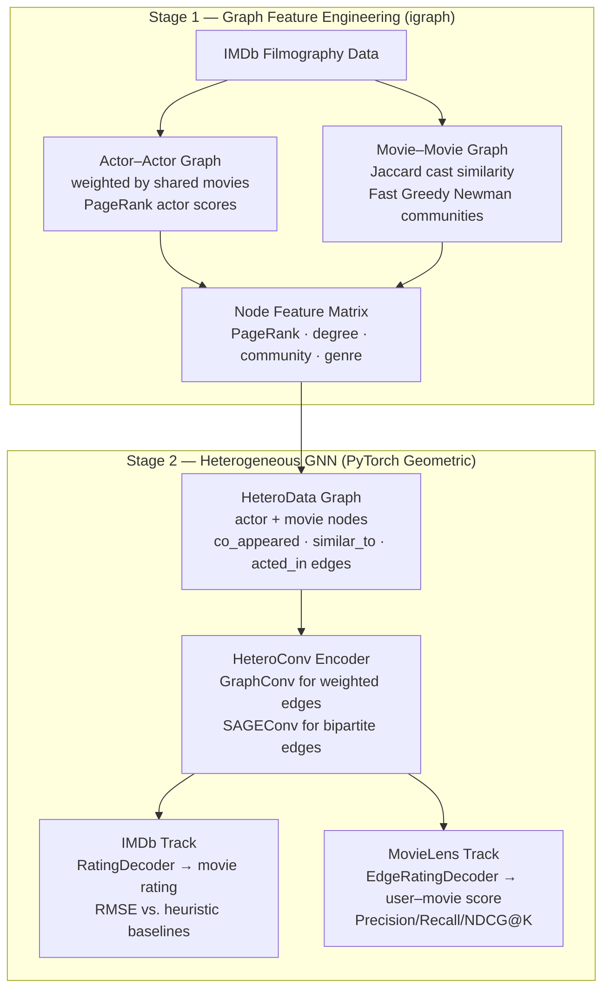
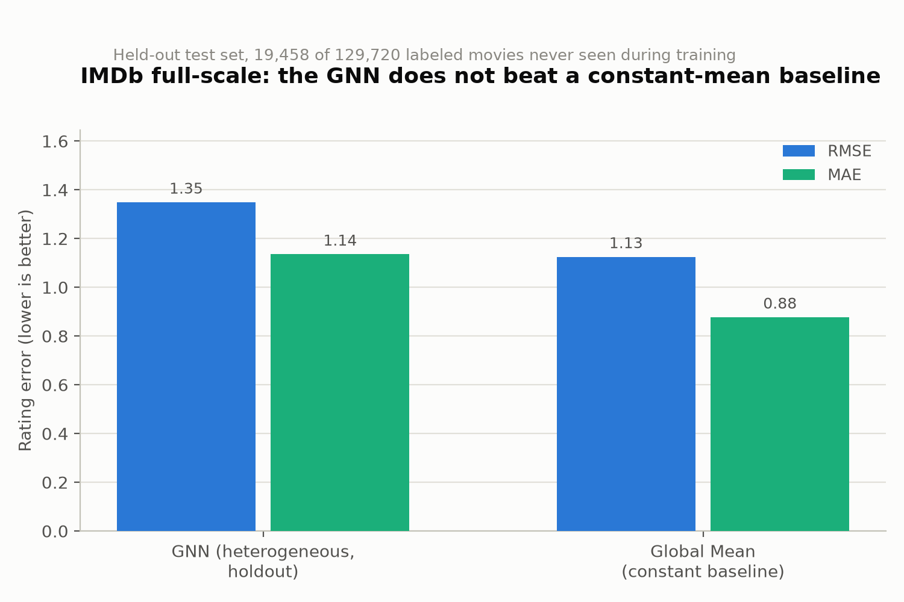
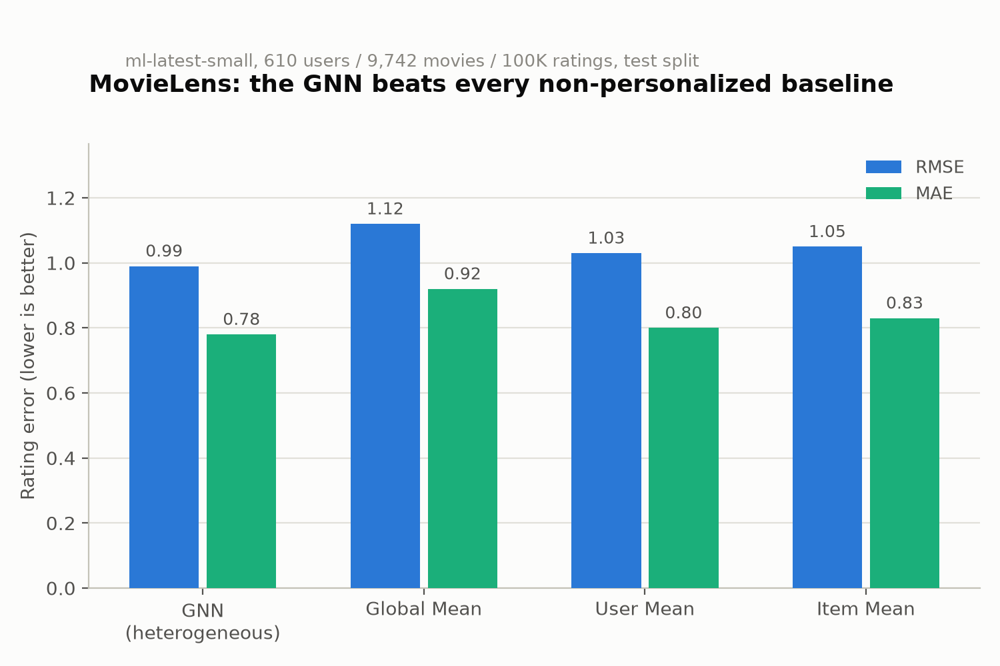

# Movie Recommender: Graph Features + a Heterogeneous GNN

[](https://www.python.org/)
[](https://pytorch.org/)
[](https://pytorch-geometric.readthedocs.io/)
[](https://scikit-learn.org/)
[](LICENSE)

## Highlights

- **Graph feature engineering, kept exactly as it was**: actor/movie networks built with `python-igraph`, actors ranked by PageRank, movie communities found with Fast Greedy Newman, all unchanged from the original coursework pipeline.
- **A heterogeneous GNN (PyTorch Geometric) on top**, trained end-to-end, that consumes those graph-derived signals (PageRank score, community id, Jaccard movie-movie similarity, cast structure) as node features and message-passing edges, instead of three independent heuristics.
- **Two tracks, two different jobs**: the IMDb track predicts a movie's aggregate rating (there's no user data in this dataset, so it can never personalize); the MovieLens track (`ml-latest-small`) adds real users and demonstrates genuine top-N recommendation with ranking metrics.
- **The three original heuristics are kept as baselines**, not replaced — every results table compares the GNN against neighborhood averaging, linear regression, and bipartite graph averaging (IMDb), and against global/user/item-mean and popularity baselines (MovieLens).
- **Honest about scale, both ways**: the IMDb *sample* has 7 labeled movies — a GNN can memorize 7 points as easily as `LinearRegression` already does, proving nothing. The *full* IMDb dataset (129,720 labeled movies, downloadable via `scripts/download_imdb_full.py`) makes the question genuinely testable, and the honest full-scale result is that this GNN, as configured here, does not beat a constant-mean baseline — see Results below.

## Project Structure

```
.
├── data/
│   ├── sample/                           # small real-data IMDb sample (unchanged, see below)
│   ├── full_raw/                         # raw IMDb Non-Commercial Datasets TSVs (gitignored)
│   ├── full/                             # built by scripts/build_imdb_full_dataset.py (gitignored)
│   └── movielens/                        # downloaded via scripts/download_movielens.py (gitignored)
├── src/python/                           # igraph feature-engineering stage (behavior unchanged)
│   ├── build_actor_movie_dicts.py        # actor/movie dictionaries + actor-actor edgelist
│   ├── compute_actor_pagerank.py         # PageRank over the actor network
│   ├── build_movie_network.py            # movie-movie similarity (Jaccard) edgelist
│   ├── detect_communities_and_neighbors.py  # community detection + genre tagging (COMMUNITY_METHOD env var, see Notes) + genre tagging
│   ├── build_movie_genre_index.py
│   ├── build_movie_rating_index.py
│   ├── predict_ratings_neighbors.py      # baseline: same-community neighbor averaging
│   ├── predict_ratings_regression.py     # baseline: linear regression on PageRank features
│   ├── predict_ratings_bipartite.py      # baseline: bipartite actor-movie graph averaging
│   └── export_features_for_gnn.py        # NEW: bridges the igraph stage to the GNN stage
├── gnn/                                  # NEW: PyTorch/PyTorch Geometric package
│   ├── data/                             # HeteroData builders (IMDb, MovieLens) + split helpers
│   ├── models/                           # HeteroGNNEncoder (shared) + RatingDecoder/EdgeRatingDecoder
│   ├── baselines/                        # IMDb heuristic parsers + MovieLens mean/popularity baselines
│   ├── metrics/                          # RMSE/MAE + Precision/Recall/NDCG@K
│   ├── training.py                       # model construction + training loops (full-batch and
│   │                                     #   NeighborLoader mini-batch, see Notes)
│   └── utils.py                          # config/seed/device/checkpoint helpers
├── configs/                              # YAML configs (one per track/scale)
│   ├── imdb_sample.yaml
│   ├── imdb_full.yaml                    # full-scale IMDb, runnable (see "With the full IMDb dataset")
│   └── movielens_small.yaml
├── scripts/
│   ├── download_movielens.py
│   ├── download_imdb_full.py             # NEW: downloads IMDb's Non-Commercial Datasets
│   ├── build_imdb_full_dataset.py        # NEW: converts them into data/full/'s expected format
│   ├── train.py                          # single entry point for both tracks
│   ├── evaluate.py                       # metrics + reports/results_summary.md
│   └── run_gnn_pipeline.sh               # one-command IMDb smoke test
├── experiments/runs/<variant>/checkpoints/   # gitignored
├── reports/results_summary.md            # generated by scripts/evaluate.py
├── results/, results_full/               # igraph stage outputs (gitignored)
├── tests/                                # shape/dtype tests, not accuracy tests (see Notes)
├── run_all.sh                            # igraph stage entry point (unchanged)
└── requirements.txt
```

### Input file formats (`data/sample/`)

Unchanged from the original pipeline:

- `actor_movies.txt` / `actress_movies.txt` — one row per actor/actress:
  `Name\tMovie Title (Year)\tMovie Title (Year)\t...`
- `director_movies.txt` — same format, one row per director.
- `director_top100.txt` — one director name per line (`Last, First`).
- `movie_genre.txt` — `Movie Title (Year)\tGenre`
- `movie_rating.txt` — `Movie Title (Year)\t\tRating` (double-tab separated)

### MovieLens (`ml-latest-small`)

Downloaded via `scripts/download_movielens.py` into `data/movielens/ml-latest-small/` (gitignored, not committed — see License). Standard MovieLens format: `ratings.csv` (`userId,movieId,rating,timestamp`), `movies.csv` (`movieId,title,genres`).

**The IMDb data has no users** — only an aggregate, point-in-time rating per movie — so the IMDb track can only ever predict a movie's rating, never recommend movies to a specific person. MovieLens is the track that actually has user-item interactions, so it's the one used for genuine personalized-recommendation evaluation (ranking metrics, per-user holdout) that the IMDb data structurally cannot support.

## Approach



### Stage 1: Graph Feature Engineering (igraph, unchanged)

- **Actor network**: directed, weighted actor-actor graph (edge weight = normalized shared-movie count); **PageRank** ranks actor influence.
- **Movie network**: undirected movie-movie graph (edge weight = **Jaccard index** of shared cast); **Fast Greedy Newman** community detection; communities tagged with a dominant genre when one genre covers ≥20% of tagged movies.
- These become inputs to Stage 2, not an end in themselves: PageRank score and degree become actor node features, community id and genre become movie node features, and the actor-actor / movie-movie edges become additional message-passing edges (`export_features_for_gnn.py` writes them as flat CSV/JSON — see Notes for why it doesn't hand the GNN stage a pickle directly).

### Stage 2a: IMDb GNN (rating regression)

- **Graph**: heterogeneous `actor`/`movie` nodes; edges `(actor, co_appeared_with, actor)` (weighted), `(movie, similar_to, movie)` (weighted, Jaccard), `(actor, acted_in, movie)` + reverse (bipartite cast structure, unweighted).
- **Features**: actor = z-scored PageRank + log-degree (+ "worked with a top-100 director" flag); movie = one-hot community id + one-hot genre + director-top-100 flag + log(cast size). **Rating is the label, never a feature.**
- **Model**: `HeteroGNNEncoder` — a 2-layer `HeteroConv` stack, `GraphConv` for the two weighted relations (it natively supports edge weights) and `SAGEConv` for the unweighted bipartite relation (config-swappable to `GATConv` for larger graphs) — feeding a small MLP (`RatingDecoder`) on the final `movie` embeddings.
- **Split**: transductive — the whole graph is always visible; only which movie *labels* are used for the loss changes. The sample has only **7 labeled movies**, far too few for a fixed holdout split, so `configs/imdb_sample.yaml` uses **leave-one-out CV** (one fresh model trained per held-out movie). `configs/imdb_full.yaml` documents a holdout-split version for the (unincluded) full dataset.

### Stage 2b: MovieLens GNN (personalized recommendation)

- **Graph**: `user` nodes (no side features — encoded via a learned embedding) and `movie` nodes (multi-hot genre + z-scored release year + mean/count rating computed **from train edges only**, to avoid leaking test ratings into a feature). Single edge type `(user, rates, movie)`, with **only train-split edges** in the message-passing graph — val/test ratings are held out of message passing entirely and exist purely as `(user, movie, rating)` supervision pairs.
- **Split**: leave-one-out per user (most-recent rating → test, second-most-recent → val, rest → train); a random-holdout alternative is also implemented.
- **Model**: the same `HeteroGNNEncoder`, with an `EdgeRatingDecoder` (concatenate user+movie embeddings → MLP) instead of the IMDb track's node-level head — this is the one piece that's genuinely track-specific, since a node-level and an edge-level head have different input shapes.
- **Evaluation**: RMSE/MAE, plus **Precision/Recall/NDCG@{5,10,20}** ranked against the *full* ~9,700-movie catalog (not sampled negatives — more rigorous, and cheap at this scale; not numerically comparable to papers using sampled negatives).

### Baselines

The three original heuristics are parsed straight from `results/predictions/*.txt` (`gnn/baselines/imdb_heuristics.py`) rather than reimplemented or re-invoked — the heuristics run in the igraph virtualenv (python-igraph, scikit-learn), the GNN runs in a separate one (torch, torch-geometric), so this avoids any cross-venv subprocess plumbing and guarantees zero risk of changing their verified behavior. MovieLens baselines (global/user/item mean, popularity) are new, in `gnn/baselines/movielens_baselines.py`.

## Results

Numbers below are from an actual run of `scripts/run_gnn_pipeline.sh` (IMDb) and `scripts/train.py --config configs/movielens_small.yaml --epochs 300` + `scripts/evaluate.py` (MovieLens) against the real downloaded `ml-latest-small`. Both tables are regenerated by `scripts/evaluate.py` into `reports/results_summary.md`.

### IMDb track (sample data, 7 labeled movies)

| Method | Batman v Superman | Mission: Impossible - Rogue Nation | Minions |
|---|:---:|:---:|:---:|
| Neighborhood Averaging | 7.05 | 7.70 | 6.30 |
| Linear Regression | 6.83 | 7.40 | 6.40 |
| Bipartite Graph Averaging | 6.97 | 7.60 | 6.40 |
| **GNN (heterogeneous, LOO)** | 6.74 | 7.72 | 5.96 |
| **IMDb (sample data)** | **6.40** | **7.40** | **6.40** |

GNN leave-one-out CV across all 7 labeled movies: **RMSE = 1.16, MAE = 0.91**. The three heuristics above only ever produced predictions for these three demo movies (that's all the original pipeline computed) — there's no comparable full-sample RMSE/MAE for them, only for the GNN's LOO-CV.

Every number above is an out-of-sample prediction. On a sample this small, a strong-looking RMSE only proves the pipeline runs correctly end-to-end — it does **not** show the architecture works at scale. A GNN can memorize 7 points as easily as `LinearRegression` already overfits them here (R² ≈ 0.42 on this sample vs. R² ≈ 0.02 on the full IMDb dataset below).

### IMDb track (full IMDb data, 129,720 labeled movies)

Built from IMDb's Non-Commercial Datasets via `scripts/download_imdb_full.py` + `scripts/build_imdb_full_dataset.py` (see "With the full IMDb dataset" below), trained with `scripts/evaluate.py --config configs/imdb_full.yaml` (mini-batch `NeighborLoader`, holdout split: 70% train / 15% val / 15% test).

| Method | Batman v Superman | Mission: Impossible - Rogue Nation | Minions |
|---|:---:|:---:|:---:|
| Neighborhood Averaging | 6.42 | 6.19 | 6.44 |
| Linear Regression | 6.15 | 6.01 | 6.20 |
| Bipartite Graph Averaging | 6.57 | 7.06 | 5.98 |
| **GNN (heterogeneous, holdout)** [*] | 5.86 | 5.15 | 5.37 |
| **IMDb (full data)** | **6.40** | **7.40** | **6.40** |

[*] all three demo movies happened to land in the *training* split of this particular random holdout, so those three GNN values are in-sample, not held out — not comparable to the other rows. This is flagged automatically by `scripts/evaluate.py` whenever it happens (see `reports/results_summary.md`).

GNN holdout test set (19,458 movies never seen during training): **RMSE = 1.35, MAE = 1.13**. A trivial "always predict the training-label average" baseline on the *same* test split scores **RMSE = 1.13, MAE = 0.88** — i.e. **the GNN, as configured and trained here (10 epochs, `hidden_dim: 64`, 2-layer SAGEConv, `num_neighbors: [15, 10]`), does not beat predicting the mean rating for every movie.**

This is an honest, real result, not a bug: the full-scale linear-regression heuristic already found essentially no signal in these features (R² ≈ 0.02 across all 129,720 labeled movies, vs. R² ≈ 0.42 on the tiny, unrepresentative 7-movie sample above) — cast PageRank/degree/community/genre/structure alone just doesn't explain much of a movie's aggregate rating at real scale, and a short mini-batch GNN training run doesn't manufacture signal that isn't there. This is the direct, concrete answer to whether a larger IMDb dataset changes the picture: yes, it's now genuinely testable (unlike the 7-movie sample, where nothing could be concluded either way) — and the honest answer this run gives is that these particular graph features are still too weak, at this scale, to beat a constant-mean baseline. Plausible next steps (not attempted here): more training epochs / wider neighbor sampling, additional node features (runtime, release year, budget/revenue if available), or a fundamentally different signal (text/synopsis embeddings, e.g.).

<picture>
  <source media="(prefers-color-scheme: dark)" srcset="reports/imdb_full_holdout_error_dark.png">
  
</picture>

On the 19,458-movie holdout split, the GNN's RMSE (1.35) and MAE (1.14) are both *higher* (worse) than simply predicting the training-set average rating for every movie (RMSE 1.13, MAE 0.88) — a visual confirmation of the "does not beat a constant-mean baseline" finding above, not an artifact of rounding.

### MovieLens track (`ml-latest-small`: 610 users, 9,742 movies, 100K ratings)

| Method | Test RMSE | Test MAE |
|---|:---:|:---:|
| **GNN (heterogeneous)** | **0.99** | **0.78** |
| Global Mean | 1.12 | 0.92 |
| User Mean | 1.03 | 0.80 |
| Item Mean | 1.05 | 0.83 |

The GNN beats every non-personalized rating baseline here — genuine signal from message-passing over the user-movie graph, not just memorization (this dataset has 100K ratings, not 7).

<picture>
  <source media="(prefers-color-scheme: dark)" srcset="reports/movielens_rmse_mae_dark.png">
  
</picture>

Unlike the IMDb track, the GNN's bars are the shortest (lowest error) of the four on both metrics here — the opposite outcome from the IMDb full-scale chart above, consistent with this track having 100K real user-item ratings to learn from instead of a single aggregate label per movie.

Ranking, full-catalog (not sampled negatives):

| Method | P@5 / R@5 / NDCG@5 | P@10 / R@10 / NDCG@10 | P@20 / R@20 / NDCG@20 |
|---|---|---|---|
| GNN | 0.000 / 0.000 / 0.000 | 0.000 / 0.000 / 0.000 | 0.000 / 0.000 / 0.000 |
| Popularity (non-personalized) | 0.004 / 0.021 / 0.012 | 0.004 / 0.036 / 0.017 | 0.003 / 0.061 / 0.023 |

**This is a real, honest finding, not a bug**: a model trained with plain MSE rating-regression loss optimizes for predicting *how much* a user would rate a movie, which is a different objective from ranking the single correct held-out movie above ~9,700 candidates — a well-documented mismatch in the recommender-systems literature (Cremonesi et al. 2010). Manually checking where the held-out movie actually lands in the GNN's ranking confirms this: across a sample of users, its rank ranged from ~670th to ~6,900th out of ~9,700 — better than random on average, but nowhere near the top 20. A ranking-aware training objective (e.g. BPR loss over sampled negatives) is the natural next step if top-N quality matters more than rating RMSE; it isn't implemented here.

## Getting Started

This project needs **two separate Python environments**: one for the igraph stage, one for the GNN stage. PyTorch wheels commonly lag the newest CPython release by months, so don't assume whatever Python you use for igraph will have a torch wheel available.

```bash
# 1. igraph + scikit-learn stage
python3 -m venv .venv
source .venv/bin/activate
pip install -r requirements.txt   # python-igraph, scikit-learn, numpy (ignore the GNN deps below for this venv)
deactivate

# 2. GNN stage (use Python 3.11-3.13; verify `pip install torch` works before going further)
python3.13 -m venv .venv-gnn
source .venv-gnn/bin/activate
pip install -r requirements.txt   # installs everything, including igraph -- harmless, just unused here
deactivate
```

### IMDb track (sample data, one command)

```bash
PYTHON_IGRAPH=.venv/bin/python3 PYTHON_GNN=.venv-gnn/bin/python3 ./scripts/run_gnn_pipeline.sh
```

This runs `run_all.sh` (igraph stage) → `export_features_for_gnn.py` (bridge) → `scripts/train.py` (smoke-test training pass) → `scripts/evaluate.py` (leave-one-out CV + `reports/results_summary.md`), end to end in a few seconds.

### MovieLens track

```bash
source .venv-gnn/bin/activate
python scripts/download_movielens.py
python scripts/train.py --config configs/movielens_small.yaml
python scripts/evaluate.py --config configs/movielens_small.yaml \
    --checkpoint experiments/runs/movielens_small/checkpoints/latest.pt
```

Training ~300 epochs over the full `ml-latest-small` graph takes well under a minute on a laptop CPU; evaluation (full-catalog ranking for 610 users) takes another ~15 seconds.

### With the full IMDb dataset

This is now a real, runnable pipeline against IMDb's official [Non-Commercial Datasets](https://developer.imdb.com/non-commercial-datasets/) (free, personal/non-commercial use only — not committed to this repo, same policy as `data/movielens/`):

```bash
# 1. Download the raw TSVs (~1.3 GB compressed) into data/full_raw/ (gitignored)
.venv/bin/python3 scripts/download_imdb_full.py

# 2. Convert them into data/full/'s actor/movie/rating text format (~90s)
#    (titleType==movie, isAdult==0, numVotes>=25 -- see the script's docstring
#    for the exact filtering/dedup/director_top100 methodology)
.venv/bin/python3 scripts/build_imdb_full_dataset.py

# 3. Run the igraph stage. COMMUNITY_METHOD=multilevel (Louvain) instead of the
#    default fast_greedy is required at this scale -- fast_greedy did not finish
#    in over 5 minutes on a ~130K-node/14M-edge movie graph; multilevel finishes
#    in ~30s with equivalent semantics (see Notes).
DATA_DIR=data/full RESULTS_DIR=results_full COMMUNITY_METHOD=multilevel ./run_all.sh
DATA_DIR=data/full RESULTS_DIR=results_full .venv/bin/python3 src/python/export_features_for_gnn.py

# 4. Train + evaluate (mini-batch NeighborLoader, holdout split -- see below)
.venv-gnn/bin/python3 scripts/evaluate.py --config configs/imdb_full.yaml
```

`configs/imdb_full.yaml` uses `gnn/training.py`'s `train_imdb_minibatch`/`predict_imdb_minibatch` (PyTorch Geometric's `NeighborLoader`) instead of full-batch training — necessary at this scale (~277K nodes, ~36M directed edges across relations after both directions are added), and requires `torch-sparse`/`torch-scatter` in the GNN venv (heterogeneous `NeighborLoader` needs one of `pyg-lib`/`torch-sparse`; neither ships by default here, see Notes for how to install `torch-sparse`+`torch-scatter` from source if no prebuilt wheel exists for your platform).

## Configuration

Each YAML config has four blocks:

```yaml
task: node_regression        # or edge_regression
data:
  track: imdb                # or movielens
  ...                        # track-specific: export_dir/split_strategy (imdb) or data_dir/min_ratings_per_user (movielens)
model:
  hidden_dim: 16
  num_layers: 2
  conv_type: sage             # sage | gat
training:
  epochs: 200
  lr: 0.01
output:
  run_dir: experiments/runs/imdb_sample
```

`scripts/train.py --config <path>` and `scripts/evaluate.py --config <path>` read `data.track`/`task` to select the right `HeteroData` builder, model head, and training loop (see `gnn/training.py`). `--epochs` and `--device` on either script override the config, for smoke tests.

## Notes

- **Dynamic movie-ID resolution** and **auto-clamped neighbor search**: unchanged from the original pipeline (see `detect_communities_and_neighbors.py` / `predict_ratings_neighbors.py`).
- **Sample data provenance**: unchanged — `data/sample/` is a small, hand-curated set of real movies/actors/directors/genres/ratings, not a representative sample, chosen purely so the pipeline runs end-to-end out of the box.
- **`COMMUNITY_METHOD` env var** (`detect_communities_and_neighbors.py`, default `fast_greedy`, unchanged): `fast_greedy` does not finish in reasonable time on the full-scale movie-movie graph (~130K nodes, ~14M edges) — set `COMMUNITY_METHOD=multilevel` (igraph's Louvain implementation) for full-scale runs, which finishes in ~30s. Sample-scale behavior is untouched since the default is unchanged.
- **Mini-batch training for the full IMDb scale** (`gnn/training.py`'s `train_imdb_minibatch`/`predict_imdb_minibatch`, PyTorch Geometric's `NeighborLoader`, selected via a config's `training.neighbor_loader` block): full-batch `train_imdb`/`predict_imdb` are kept as the default for the sample/MovieLens tracks, which are small enough that full-batch is simply faster and simpler. Heterogeneous `NeighborLoader` requires `torch-sparse` + `torch-scatter` (not `pyg-lib`, which had no prebuilt wheel available for this project's platform/Python/torch combination at the time of writing) — if no prebuilt wheel exists for yours either, `pip install --no-build-isolation torch-scatter torch-sparse` compiles them locally (needs a C++ compiler; Xcode Command Line Tools on macOS).
- **Why the GNN reads flat CSV/JSON, not pickles directly**: `export_features_for_gnn.py` is a pure exporter with no PyTorch import at all. The igraph stage and GNN stage run in separate Python virtualenvs (see Getting Started), so a flat, self-documenting file format avoids ever unpickling something written by a different Python/numpy version.
- **GNN honesty on the IMDb sample**: see Results above — leave-one-out CV is used specifically because 7 labeled movies is too few for any fixed split to be meaningful, and a good LOO RMSE here is evidence the pipeline runs, not evidence the architecture generalizes. The full-scale run above uses a genuine random holdout split instead, which is the real test of generalization the sample can't provide.
- **MovieLens ranking protocol**: ranks against the full movie catalog (not sampled negatives) — more rigorous, but not numerically comparable to papers/benchmarks that sample negatives. See the RMSE-vs-ranking mismatch note in Results.
- **`torch-geometric` is installed without its optional compiled extensions by default** (`torch-scatter`, `torch-sparse`, `pyg-lib`) — `HeteroConv` + `SAGEConv`/`GraphConv`/`GATConv` don't need them for full-batch training. `NeighborLoader` on a heterogeneous graph does (see above). An `ImportError` naming one of those packages means whatever you're running needs them; see [PyG's install matrix](https://pytorch-geometric.readthedocs.io/en/latest/install/installation.html).
- **Two virtualenvs, not one**: see Getting Started. Don't assume the Python you use for `python-igraph` also has a `torch` wheel available.
- **`data/full/`'s movie keys must exactly match the igraph stage's internal cleaning** (`build_actor_movie_dicts.py`'s special-character-strip + parenthetical-removal regex) — `scripts/build_imdb_full_dataset.py` applies the identical regex when generating `movie_genre.txt`/`movie_rating.txt`, since those two files are read verbatim (no further cleaning) downstream. See that script's docstring for why this matters.
- Data cleaning and consistent actor/movie indexing across scripts remain the most critical (and most fiddly) part of the igraph stage — unchanged from before.

## License

This project is licensed under the [Apache License 2.0](LICENSE).

The sample data in `data/sample/` is a small, hand-curated set of real movie, actor, and rating information assembled for demonstration purposes. This repo does not redistribute IMDb's proprietary datasets. The full-scale data in `data/full/`/`data/full_raw/` (built via `scripts/download_imdb_full.py` + `scripts/build_imdb_full_dataset.py`) is derived from IMDb's [Non-Commercial Datasets](https://developer.imdb.com/non-commercial-datasets/), free for personal/non-commercial use only — also not committed to this repo.

MovieLens data (`data/movielens/`, downloaded via `scripts/download_movielens.py`, not committed) is licensed separately by GroupLens/University of Minnesota for non-commercial research/education use; see the [ml-latest-small README](https://files.grouplens.org/datasets/movielens/ml-latest-small-README.html). Per that license, this project cites: F. Maxwell Harper and Joseph A. Konstan. 2015. *The MovieLens Datasets: History and Context*. ACM Transactions on Interactive Intelligent Systems 5, 4: 19:1-19:19.
