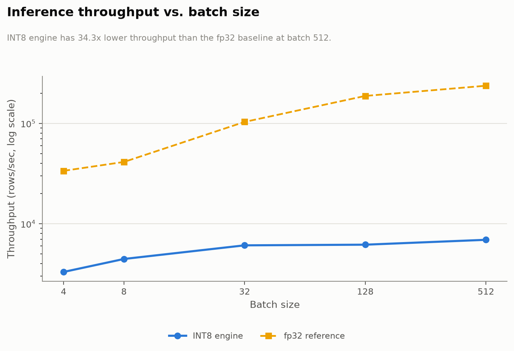
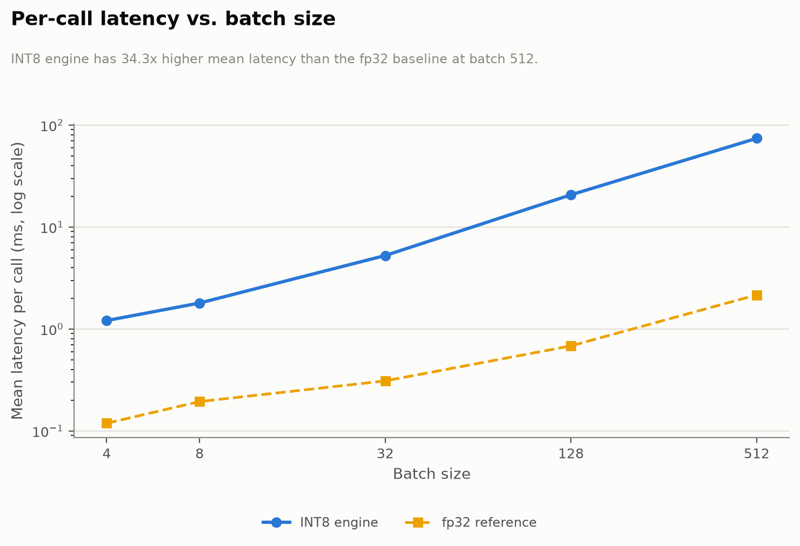

# Tensor Graph Inference Engine

[](https://www.python.org/)
[](https://numpy.org/)
[](LICENSE)

> A minimal, CPU-only static-graph neural network inference engine (think: a stripped-down ONNX Runtime or GGML). An offline compiler parses a model's DAG, quantizes weights to INT8, and pre-plans a single contiguous memory arena via tensor-lifetime analysis. The runtime then executes a forward pass touching only that pre-planned memory, writing every intermediate result into a pre-existing view rather than allocating a fresh array per step.

Originally built in C++ (header-only, zero-allocation via `operator new`/`delete` overrides), then fully migrated to Python/NumPy — same algorithm, same byte-exact binary artifact format, same regression-pinned constants.

## Why

In high-performance/embedded/real-time deployment, allocating memory during inference is a fatal error: it introduces unpredictable latency, can fail under memory pressure, and defeats static analysis of worst-case execution time. The standard fix is to move all memory planning **offline**: parse the network's computation graph once, at compile time, compute the exact lifetime of every intermediate tensor, and pack them into a single pre-sized arena, reusing space for tensors whose lifetimes don't overlap. The runtime then just loads that plan and executes with pure pointer arithmetic.

This project builds that pipeline end to end for a small residual MLP:

- an **offline compiler** (`scripts/01_compile_model.py`) that builds an in-memory DAG, quantizes weights/activations to INT8 (per-tensor symmetric scale, INT32 accumulation, fused bias), runs a greedy interval-allocation memory planner, and serializes everything into a flat binary artifact;
- a **runtime** (`src/engine.py`) that loads that artifact and runs `forward()` by taking zero-copy NumPy views (`ndarray.view(dtype)` over basic slices) into two buffers allocated exactly once at load time — proven by tests that assert the arena's identity/pointer never changes across repeated `forward()` calls and that every output is a view sharing memory with the arena, not a freshly allocated array.

## What It Builds

The demo network is a 3-layer MLP **with a residual/skip connection** (not just a linear chain) so the memory planner has to prove something non-trivial: keep one activation tensor alive across several unrelated intermediate computations while reclaiming other buffers underneath it.

```text
Input (fp32, [8, 784])
  -> quantize -> INT8 matmul + INT32 bias (784x128) -> dequantize -> ReLU  =: H1  ----------.
                                                                                            |
  H1 -> quantize -> INT8 matmul + INT32 bias (128x128) -> dequantize -> ReLU -> Add <-------'
                                                                                  |
                                                     quantize -> INT8 matmul + INT32 bias (128x10)
                                                                                  |
                                                                    dequantize -> softmax -> argmax
```

`H1` (produced after the first ReLU) is read again by the `Add` node five ops later — it must stay resident through the second layer's quantize/matmul/dequantize/relu, while the buffers used *by* those ops (already dead by then) get reused elsewhere in the arena.

## Repository Layout

```text
.
├── requirements.txt                # numpy + pytest + matplotlib (plotting only)
├── src/
│   ├── types.py                    # DType/TensorKind/OpType, alignment helpers
│   ├── ops.py                      # quantize/dequantize, INT8 matmul, relu, add, softmax, argmax
│   ├── fp32_reference.py           # fp32 ground truth + synthetic data generators
│   ├── graph.py                    # offline in-memory graph + GraphBuilder
│   ├── arena_planner.py            # tensor lifetime analysis + greedy arena allocator
│   ├── model_format.py             # byte-precise compiled artifact (read + write)
│   ├── engine.py                   # the zero-allocation-spirit runtime
│   └── demo_graph.py                # the concrete demo topology (shared by scripts + tests)
├── scripts/
│   ├── 01_compile_model.py         # offline compiler CLI
│   ├── 02_infer.py                 # inference CLI runner
│   └── 03_benchmark.py             # INT8 vs. fp32 latency/throughput benchmark
├── reports/
│   ├── benchmark_results.csv       # persisted output of 03_benchmark.py
│   └── generate_plots.py           # renders reports/*.png from the CSV (no retraining/rerun)
├── tests/                          # op-level, arena-planner, model-format, end-to-end, zero-alloc tests
└── docs/arena_design.md            # full pseudocode + worked example for the planner
```

## Quantization Scheme

Per-tensor **symmetric** INT8 quantization, zero-point fixed at `0`:

```
scale = max(abs(tensor)) / 127
quantized = clamp(round(value / scale), -128, 127)
```

Weights and biases are quantized once, offline, by the compiler. Activation scales are calibrated from a single forward pass over representative input at compile time. Each INT8 matmul accumulates in INT32 with the (already-quantized) bias fused directly into the accumulator — the "scale-shifting" step is the subsequent dequantize, `fp32_value = int32_accumulator * (input_scale * weight_scale)`.

`round` here means **round-half-away-from-zero** (matching the original C++ `std::round`/`std::lround`), not NumPy's default round-half-to-even ("banker's rounding"). `src/ops.py` implements this explicitly (`round_half_away_from_zero`), since the two rounding modes disagree at exact `.5` boundaries and the numeric-accuracy assertions in the test suite are written against the round-half-away-from-zero convention. This only affects numeric precision, not the byte-count regressions below (those are pure shape/topology facts, independent of how any value gets rounded).

The INT8 matmul itself (`op_matmul_int8` in `src/ops.py`) is a plain `activation.astype(np.int32) @ weight.astype(np.int32)` followed by an INT32 bias add. The original C++ version used a K-blocked scalar GEMM as a cache-locality/auto-vectorization optimization — a CPU-idiomatic analogue of a GPU shared-memory-tiled kernel — but that blocking is purely a re-association of loop order with no semantic effect (still one sequential INT32 accumulator per output element), so the direct NumPy matmul reproduces its output exactly.

## Static Memory Arena

See [`docs/arena_design.md`](docs/arena_design.md) for the full algorithm and a worked example. In short:

1. **`compute_lifetimes()`** walks the topologically-sorted node list once and records, for every intermediate tensor, `[start_node, end_node]` — the node that produces it and the last node that consumes it. Graph inputs/outputs are pinned for the whole run.
2. **`plan_arena()`** sorts tensors by start time and runs a greedy first-fit interval allocator: as each tensor's lifetime begins, any earlier (non-pinned) tensor whose lifetime has already ended is returned to a free list and its space reused.
3. The result — one offset per tensor and a total arena size — is baked into the compiled artifact. The runtime allocates that many bytes **once**, at load time (`np.zeros(arena_size_bytes, dtype=np.uint8)`), and never again; every tensor is a `.view(dtype)` over a basic slice of that single buffer.

For the demo model at batch size 8, the naive "sum of every intermediate tensor" would need **63,072 bytes**; the planner produces an arena of **39,904 bytes** — a ~37% reduction purely from lifetime-aware reuse, with the residual tensor `H1`'s slot provably untouched by anything allocated during the second layer's computation.

## Compiled Artifact Format (`.tge`)

A single flat binary file, back to back with no gaps:

```
FileHeader (64B)  ->  TensorDesc[num_tensors] (48B each)  ->  NodeDesc[num_nodes] (24B each)  ->  weights_blob
```

The arena's *bytes* are never stored on disk, only its *size* — the runtime allocates a fresh zero-initialized buffer at load time and computes every tensor's address as `arena_base + tensor_table[id].offset`. The format is reproduced byte-exact from the original C++ struct layouts, using NumPy structured dtypes (`np.dtype([("field", "<u4"), ...])`) so `parse()` stays genuinely zero-copy: `np.frombuffer` over an immutable `bytes` object always returns a read-only view, never a copy. See `src/model_format.py` for the exact struct layouts.

## Setup

```bash
pip install -r requirements.txt
```

## Run

```bash
python scripts/01_compile_model.py --output models/demo.tge --batch 8
python scripts/02_infer.py --model models/demo.tge
```

`01_compile_model.py` prints tensor/node counts, arena size, and weights-blob size. `02_infer.py` loads the artifact, runs a forward pass on synthetic input, and prints per-row predictions and probabilities.

## Testing

```bash
pytest
```

- **`test_ops.py`** — quantize/dequantize round-trip, INT8 matmul vs. an fp32 reference within a derived quantization-error bound, relu, softmax, argmax.
- **`test_arena_planner.py`** — synthetic DAGs with known overlapping/disjoint lifetimes, asserting exact offsets (disjoint lifetimes reuse the same offset, overlapping lifetimes never alias, pinned tensors are never reused), plus a regression pin of the real demo graph's arena size.
- **`test_model_format.py`** — round-trips `write_artifact()` through `parse()`, asserting the struct itemsizes (64/48/24 bytes) and that every field survives exactly; new coverage added for the Python port, no direct C++ equivalent.
- **`test_end_to_end.py`** — the full INT8 demo graph vs. the fp32 reference forward pass over the same weights/input, bounded probability error, prediction agreement.
- **`test_zero_alloc.py`** — a Python reinterpretation of the original C++ `operator new`/`delete`-override test: asserts the arena's identity/pointer never changes across repeated `forward()` calls, that outputs are views sharing memory with the arena (`np.shares_memory`), and that repeated calls don't grow Python-tracked memory by anything close to a tensor's worth of bytes. CPython/NumPy can't literally intercept `malloc` the way C++ can, so this tests the properties that actually capture the design intent rather than a literal zero-byte guarantee.

## Benchmarks

Does the compiled, zero-allocation INT8 engine actually run faster than a naive fp32 NumPy forward pass over the same tiny model? `scripts/03_benchmark.py` answers that directly: it times `Engine.forward()` against `fp32_reference.run_fp32_reference()` on identical weights and input, across a batch-size sweep, with a warmup phase and 500 timed iterations per point.

```bash
python scripts/03_benchmark.py --output reports/benchmark_results.csv
python reports/generate_plots.py
```

**Hardware:** GCP Compute Engine `e2-standard-4` (4 vCPU, Intel Xeon @ 2.20GHz, 16GB RAM), `us-central1-a`, Debian 12, Python 3.11.2 — chosen for a clean, reproducible, non-burstable CPU baseline rather than a laptop number. Every result below was reproduced by a second full run on the same VM, agreeing within ~1-8%.

| Batch | Engine | Mean Latency (ms) | P99 Latency (ms) | Throughput (rows/s) |
| ---: | :--- | ---: | ---: | ---: |
| 4 | INT8 | 1.21 | 1.54 | 3,309 |
| 4 | fp32 | 0.12 | 0.19 | 33,657 |
| 8 | INT8 | 1.80 | 2.18 | 4,455 |
| 8 | fp32 | 0.19 | 0.41 | 41,261 |
| 32 | INT8 | 5.25 | 6.02 | 6,091 |
| 32 | fp32 | 0.31 | 0.47 | 103,399 |
| 128 | INT8 | 20.70 | 22.65 | 6,183 |
| 128 | fp32 | 0.68 | 1.10 | 187,617 |
| 512 | INT8 | 74.04 | 82.21 | 6,915 |
| 512 | fp32 | 2.16 | 3.03 | 237,082 |

<picture>
  <source media="(prefers-color-scheme: dark)" srcset="reports/throughput_vs_batch_dark.png">
  
</picture>

<picture>
  <source media="(prefers-color-scheme: dark)" srcset="reports/latency_vs_batch_dark.png">
  
</picture>

**The honest result: on this CPU/NumPy implementation, the INT8 engine is 28-38x slower than the naive fp32 baseline at every batch size tested, and the gap widens as batch grows.** Two things compound:

- `op_matmul_int8` (`src/ops.py`) is a plain `activation.astype(np.int32) @ weight.astype(np.int32)`. NumPy has no standard vectorized integer GEMM path the way it does for `float32 @ float32` (which dispatches into OpenBLAS/MKL's SIMD-tiled kernels) — so the INT8 matmul almost certainly falls back to a much slower generic loop, even though it's doing less *conceptual* work (8-bit operands vs. 32-bit floats).
- `Engine.forward()` walks a 14-node Python-level dispatch loop (`_run_node`'s `if/elif` chain) on every call, adding fixed per-call overhead that `run_fp32_reference()`'s much shorter, branch-free call sequence doesn't pay. This overhead is roughly constant per call, which is why the fp32 baseline's throughput scales up substantially with batch size (BLAS gets more efficient on larger matmuls) while the INT8 engine's throughput barely moves — the dispatch loop, not the arithmetic, dominates at every size tested here.

Neither result should be surprising in hindsight, and neither undermines the project's actual claim: the zero-allocation arena (see [Static Memory Arena](#static-memory-arena)) is about *deterministic, allocation-free memory behavior* for embedded/real-time deployment, not raw FLOP/s — a fp32 baseline that allocates a fresh array on every call is a legitimately different tradeoff, not a strictly better one, even though it wins on this metric. Closing the throughput gap would require a real vectorized INT8 kernel (what the original C++ implementation's cache-blocked scalar GEMM was reaching for — see [Quantization Scheme](#quantization-scheme)), which NumPy doesn't provide out of the box; see [Possible Extensions](#possible-extensions).

## Possible Extensions

- A vectorized/BLAS-backed INT8 GEMM kernel — `op_matmul_int8` doesn't hit an accelerated path the way NumPy's `float32 @` operator does (see [Benchmarks](#benchmarks)); closing that gap is a prerequisite before the zero-allocation design could also compete on raw throughput, not just on predictable memory behavior.
- Per-channel (rather than per-tensor) weight quantization for better accuracy at low bit-width.
- A general topological sort in `GraphBuilder`, rather than relying on construction order (fine for a hand-built demo graph; would matter for a graph assembled from an arbitrary op list).
- Best-fit or slab-class allocation strategies in the arena planner instead of first-fit, to reduce fragmentation on larger/more irregular graphs.
- Vectorized SIMD-style batching across multiple independent inference calls, rather than one graph execution at a time.

## Further Reading

- Jacob, B., et al. "Quantization and Training of Neural Networks for Efficient Integer-Arithmetic-Only Inference." *CVPR*, 2018. [arxiv.org/abs/1712.05877](https://arxiv.org/abs/1712.05877)
- [Arena design notes](docs/arena_design.md)

## License

This project is licensed under the [MIT License](LICENSE).
